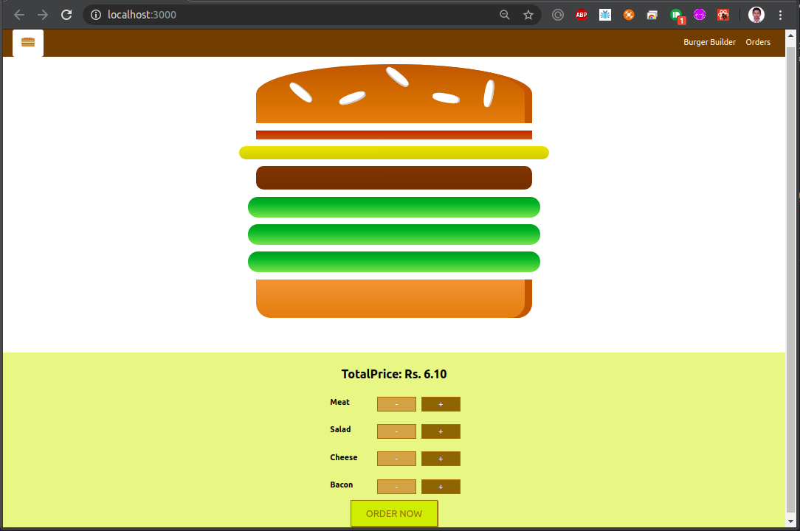
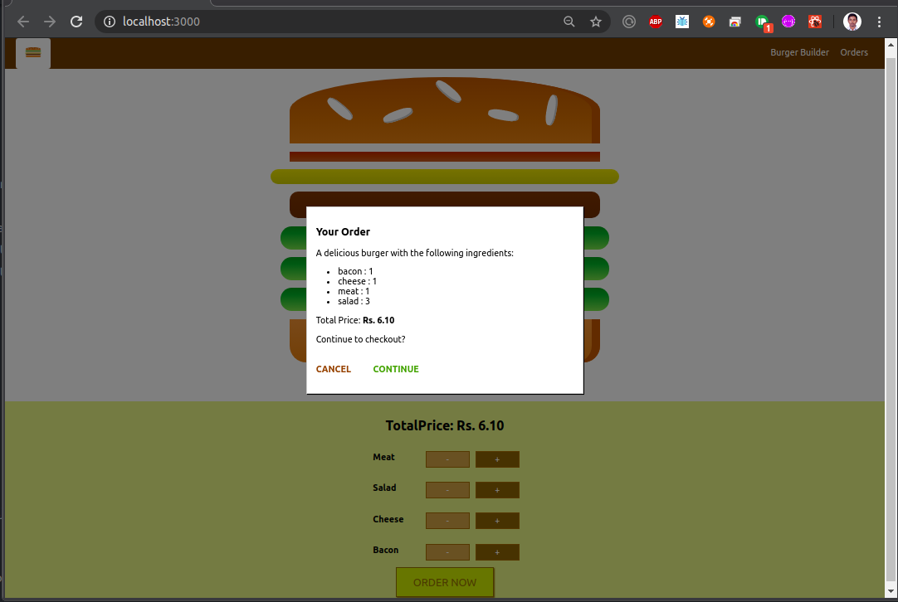
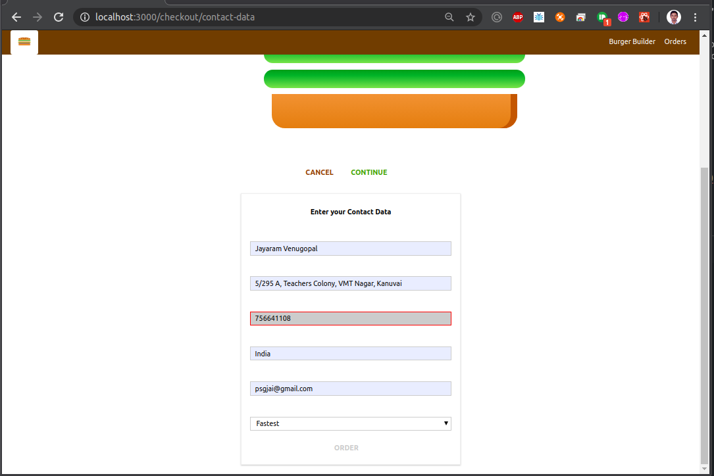
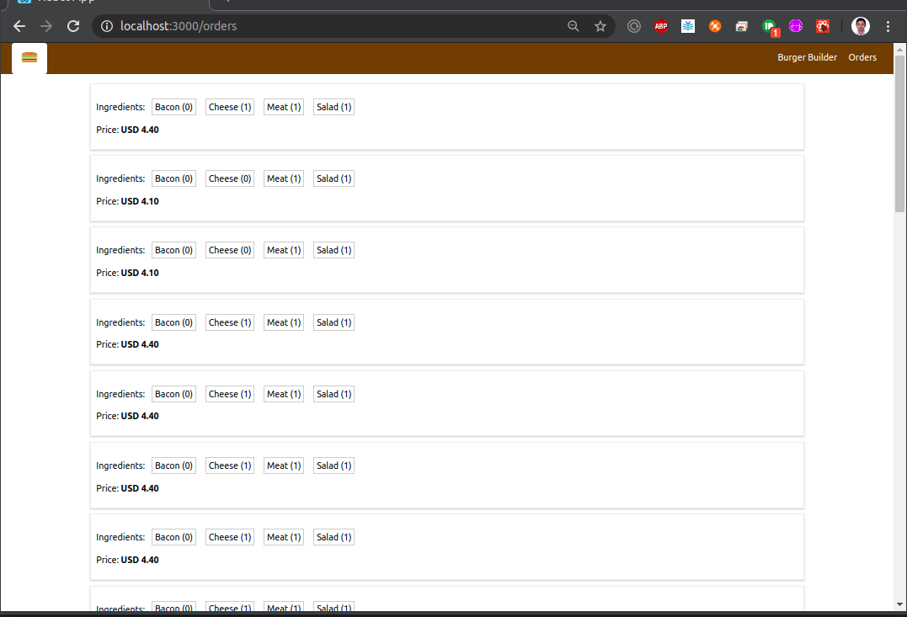
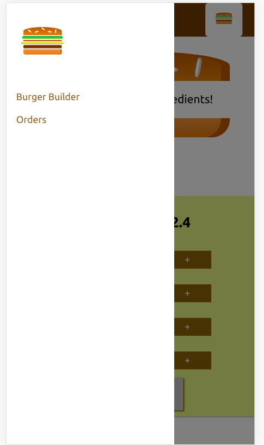

# BurgerBuilder

Burger Builder is a react component with a collection of effects and styles using CSS transitions application. It is multipage routing application with form and form validations.
In this application all order data are stored in the google firebase.

## Demo & examples

To build the examples locally, run:

```
npm install
npm start
```

Then open [`localhost:3000`](http://localhost:3000) in a browser.

## Snapshot

HomeScreen



PlaceOrder



CustomerDetails



OrderList



MobileView


